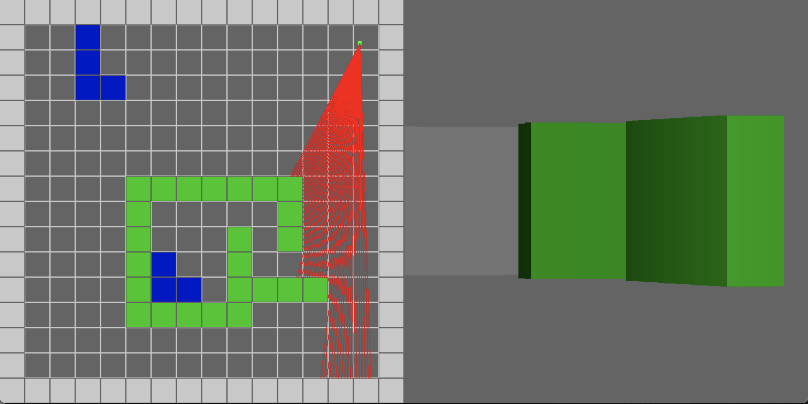

# Ray The Caster

A (very) simple ray caster using Go and SDL

## Info

Just a fun project to see how hard it would be to create a Wolfenstein3D like 
ray caster. I have not put much effort into optimization for either CPU or 
memory as I'm favoring readability over speed. 

I have also not added texture maps or complex lighting. I may add these at some
point in the future, but I really just wanted to create a basic space I could
explore.

## Build

This is in Go (since that is what I use most of the time at work) with SDL 
for drawing.  In order to build this you first need to 

`brew install sdl2{,_image,_mixer,_ttf,_gfx} pkg-config`

and then you should be able to just build and run the app.

## Status

I'm still playing around with some of the color shading and I may 
go through and do some small optimizations, but for the most part
I'm done with the main work.

## TODO

* (DONE) Get basic character (box) moving around the screen
* (DONE) Render walls
* (DONE) Add direction line to character
* (DONE) Motion in direction
* (DONE) Draw single casting ray
* (DONE) Draw Field of View casting rays
* (DONE) Render 3D
* (DONE) 3D shading using angles
* (DONE) Remove fish-eye
* (DONE) 3D shading using distance

## Notes & Useful Links

* https://github.com/veandco/go-sdl2-examples/tree/master
* https://github.com/veandco/go-sdl2
* https://lodev.org/cgtutor/raycasting.html
* https://www.youtube.com/watch?v=gYRrGTC7GtA&ab_channel=3DSage
* https://www.youtube.com/watch?v=NbSee-XM7WA&ab_channel=javidx9

## Images

### Ray casting in 2D

### Ray casting in 2D & 3D

